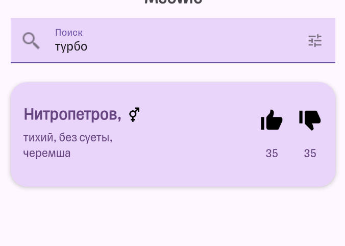
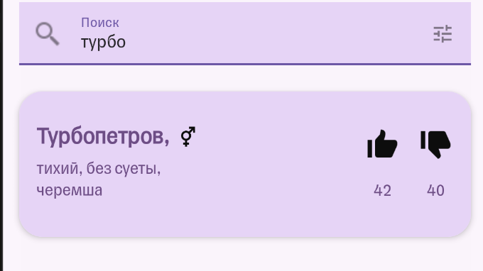
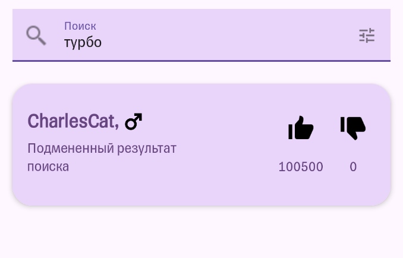
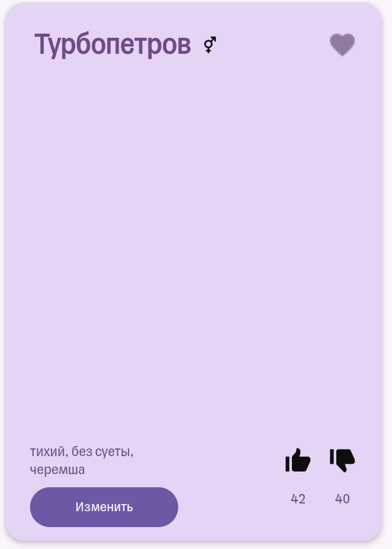

# Отчет по лабораторной работе Т3

# Выполнил студент группы P4150 Добродум Александр Вадимович

## Часть 1. Разведка API через Swagger

Таблица была составлена с помощью ИИ, на основе .

| Method | Path | Назначение | Параметры | Пример запроса | Пример ответа |
|--------|------|------------|-----------|----------------|---------------|
| **Поиск котиков** |
| POST | `/cats/search` | Поиск по имени и полу | `name` (string), `gender` (male/female/unisex) | `{"name": "Tom", "gender": "male"}` | `{"groups": [{"title": "T", "count": 1, "cats": [{"id": 1, "name": "Tom", "gender": "male"}]}]}` |
| POST | `/api/core/cats/search` | Мобильный поиск с сортировкой | `name` (string), `order` (asc/desc), `gender` (male/female/unisex) | `{"name": "Tom", "order": "asc", "gender": "male"}` | Группы котов |
| GET | `/cats/search-pattern` | Поиск по началу имени | `name` (string) — часть начала имени, `limit` (number) — ограничение вывода | `/cats/search-pattern?name=To&limit=10` | `{"moreResults": false, "cats": [{"id": 1, "name": "Tom"}]}` |
| GET | `/cats/all` | Вывод списка всех котов | `order` (asc/desc) — обязательный, `gender` (male/female/unisex) — опционально | `/cats/all?order=asc&gender=male` | `{"groups": [{"title": "A", "count": 2, "cats": [...]}]}` |
| **Просмотр карточки по id** |
| GET | `/cats/get-by-id` | Получение кота по id | `id` (number) — обязательный | `/cats/get-by-id?id=1` | `{"cat": {"id": 1, "name": "Tom", "gender": "male", "likes": 5, "dislikes": 1}}` |
| GET | `/api/core/cats/get-by-id` | Мобильное получение кота по id | `id` (number) — обязательный | `/api/core/cats/get-by-id?id=1` | Объект `cat` |
| **Добавление имени** |
| POST | `/cats/add` | Добавление списка имен | `cats` — массив объектов с `name` (string), `gender` (enum), `description` (string) | `{"cats": [{"name": "Tom", "gender": "male", "description": "Рыжий кот"}]}` | `{"cats": [{"id": 1, "name": "Tom", "gender": "male"}]}` |
| POST | `/api/core/cats/add` | Мобильное добавление котов | `cats` — массив объектов с `name`, `gender`, `description` | `{"cats": [{"name": "Tom", "gender": "male"}]}` | Добавленные коты или бизнес-ошибка |
| **Изменение описания** |
| POST | `/cats/save-description` | Сохранение описания кота | `catId` (number), `catDescription` (string) | `{"catId": 1, "catDescription": "Очень умный кот"}` | `{"id": 1, "name": "Tom", "description": "Очень умный кот"}` |
| POST | `/api/core/cats/save-description` | Мобильное сохранение описания | `catId` (number), `catDescription` (string) | `{"catId": 1, "catDescription": "Любит рыбу"}` | Обновленный `cat` |
| **Лайк и дизлайк** |
| POST | `/cats/{catId}/like` | Добавление лайка коту | `catId` (integer) — в пути | `/cats/1/like` | `OK` |
| DELETE | `/cats/{catId}/like` | Удаление лайка у кота | `catId` (integer) — в пути | `DELETE /cats/1/like` | `OK` |
| POST | `/cats/{catId}/dislike` | Добавление дизлайка коту | `catId` (integer) — в пути | `/cats/1/dislike` | `OK` |
| DELETE | `/cats/{catId}/dislike` | Удаление дизлайка у кота | `catId` (integer) — в пути | `DELETE /cats/1/dislike` | `OK` |
| POST | `/api/likes/cats/{catId}/likes` | Мобильное голосование за кота | `catId` (integer) — в пути, `like` (boolean), `dislike` (boolean) | `{"like": true, "dislike": false}` | Обновленный `cat` |
| **Рейтинг** |
| GET | `/cats/likes-rating` | Получение ТОП-10 по лайкам | Нет | `/cats/likes-rating` | `[{"name": "Tom", "likes": 100}]` |
| GET | `/cats/dislikes-rating` | Получение ТОП-10 по дизлайкам | Нет | `/cats/dislikes-rating` | `[{"name": "Jerry", "dislikes": 50}]` |
| GET | `/api/likes/cats/rating` | Мобильный рейтинг (лайки и дизлайки) | Нет | `/api/likes/cats/rating` | Объект с массивами `likes` и `dislikes` |
| **Просмотр и загрузка фото** |
| GET | `/cats/{catId}/photos` | Получение изображений по id кота | `catId` (integer) — в пути | `/cats/1/photos` | `{"images": ["/uploads/cat1_1.jpg", "/uploads/cat1_2.jpg"]}` |
| GET | `/api/photos/cats/{catId}/photos` | Мобильный список фотографий | `catId` (integer) — в пути | `/api/photos/cats/1/photos` | Массив относительных ссылок `images` |
| POST | `/cats/{catId}/upload` | Добавление изображения кота | `catId` (integer) — в пути, `file` (binary) — form-data | (multipart/form-data с файлом) | `{"fileUrl": "/uploads/cat1_3.jpg"}` |
| POST | `/api/photos/cats/{catId}/upload` | Мобильная загрузка фото | `catId` (integer) — в пути, `file` (binary) | (multipart/form-data с файлом) | Относительная ссылка `fileUrl` |
| **Удаление или изменение данных через web API** |
| DELETE | `/cats/{catId}/remove` | Удаление кота | `catId` (integer) — в пути | `DELETE /cats/1/remove` | `OK` |
| GET | `/cats/validation` | Получение правил валидации | Нет | `/cats/validation` | `[{"id": 1, "description": "Имя только буквы", "regex": "^[A-Za-z]+$"}]` |
| GET | `/version` | Получение версии проекта | Нет | `/version` | `{"build": 123}` |

## Часть 2. Карта действий приложения

| Действие в приложении | HTTP method | URL | Request body | Response code | Response body | Комментарий |
| --- | --- | --- | --- | --- | --- | --- |
| 1. Поиск котика | POST | http://144.31.255.0:3001/api/core/cats/search | {"gender": null, "name": "Вадим", "order": "asc"} | 200 | {"groups":[{"title":"В","cats":[{"id":14,"name":"Вадим","description":"Очень крутой кот , супер да крутой да","tags":"","gender":"male","likes":2,"dislikes":0}],"count":1}]}  | Нашёл Вадима |
| 2. Открытие карточки | GET | http://144.31.255.0:3001/api/core/cats/get-by-id?id=18 | - | 200 | {"cat":{"id":18,"name":"Обормотик","description":"Разлохмаченный животик, мокрые лапки.","tags":"","gender":"unisex","likes":1,"dislikes":0}} | Выстраданный второй запрос... Настроил прокси на самом устройстве внутри эмулятора. |
| 3. Лайк | POST | http://144.31.255.0:3001/api/likes/cats/18/likes | {"dislike":false,"like":true} | 200 | {"id":18,"name":"Обормотик","description":"Разлохмаченный животик, мокрые лапки.","tags":"","gender":"unisex","likes":2,"dislikes":0} | - |
| 4. Дизлайк | | | {"dislike":true,"like":false} | | | используется тот же запрос что для Лайка, меняется лишь тело запроса, по факту пользователь может ставить бесконечное кол-во лайко и дизлайков, если будет поочерёдно тыкать кнопки|
| 5. Добавление нового котика | POST | http://144.31.255.0:3001/api/core/cats/add | {"cats":[{"description":"тихий, без суеты","gender":"unisex","name":"турбопетров"}]} | {"cats":[{"id":21,"name":"Турбопетров","description":"тихий, без суеты","tags":"","gender":"unisex","likes":0,"dislikes":0}]} | 200 | Тихо, не спеша, черемша, ша ша ша ша |
| 6. Изменение описания | POST | http://144.31.255.0:3001/api/core/cats/save-description | {"catDescription":"тихий, без суеты, черемша\n","catId":21} | {"id":21,"name":"Турбопетров","description":"тихий, без суеты, черемша\n","tags":"","gender":"unisex","likes":0,"dislikes":0} | 200 | - |
| 7. Загрузка изображения | POST | http://144.31.255.0:3001/api/photos/cats/21/upload | байты изображения, поэтому многовато для вставки | 200 | {"fileUrl":"/photos/image-1780064483119.jpg"} | - |
| 8. Открытие рейтинга | GET | http://144.31.255.0:3001/api/likes/cats/rating | - | 200 | длинный json списко котиков| - |

## Часть 3. Изменение запросов

| Тип эксперемента | Исходный запрос | Изменённый запрос | Ответ сервера | Изменилось ли состояние данных | Является ли поведение багом или security-проблемой | Как бы вы исправили проблему |
| --- | --- | --- | --- | --- | --- | --- |
| Изменение catId | http://144.31.255.0:3001/api/likes/cats/1/likes | http://144.31.255.0:3001/api/likes/cats/2/likes | {"id":2,"name":"Мурка","description":"Тестовая кошка для проксирования","tags":"","gender":"female","likes":1,"dislikes":1} | Изменилось описание и при последующих запросах на лайк, запросы отправлялись уже для кошки с id: 2 | Это security-проблема, поскольку пользователь получает возможность менять данные других кошек неявно | Нужно понять, почему перезаписывается id после возвращения результата запроса |
| Повторение запроса | "http://144.31.255.0:3001/cats/get-by-id?id=4" | - | {"cat":{"id":4,"name":"Кекс","description":"Имя для экспериментов с поиском","tags":null,"gender":"unisex","likes":0,"dislikes":0}} | нет | ни тем, ни этим не является | - |
| Невалидное значение gender | "http://144.31.255.0:3001/cats/add" -H "accept: application/json" -H "Content-Type: application/json" -d "{\"cats\":[{\"name\":\"Саша\",\"gender\":\"genderfluid helisexual\",\"description\":\"string\"}]}" | - | "data": "error: invalid input value for enum gender: \"genderfluid helisexual\"\n    at Connection.parseE (/app/node_modules/pg/lib/connection.js:602:11)\n | нет | баг | Изменить валидацию, чтобы сервер не выкидывал ошибку, а возвращал сообщение о невалидных данных |
| Несуществующий catId | http://144.31.255.0:3001/cats/get-by-id?id=6 | - | {"data":null,"isBoom":true,"isServer":false,"output":{"statusCode":404,"payload":{"statusCode":404,"error":"Not Found","message":"cat not found"},"headers":{}}} | нет | нет | - |
| Неправильный файл c расширением .js | http://144.31.255.0:3001/api/photos/cats/1/upload | - | <!DOCTYPE html><html lang="en"><head><meta charset="utf-8"><title>Error</title></head><body><pre>Internal Server Error</pre></body></html> | нет | баг | тоже что и для gender |
| Изменение описания чужого кота | "http://144.31.255.0:3001/cats/save-description" -H "accept: application/json" -H "Content-Type: application/json" -d "{\"catId\":13,\"catDescription\":\"я даже не знаю существует ли этот кот\"}" | - | {"cat":{"id":13,"name":"Ывф","description":"я даже не знаю существует ли этот кот","tags":null,"gender":"female","likes":0,"dislikes":0}} | да | security | Ввод полноценной авторизации и параметра авторства для каждого кота, чтобы другие пользователи и не авторизованне не могли их менять |

## Часть 4. Изменение ответов

1. Подмените имя или описание котика в ответе поиска.

| До | После |
| --- | --- |
|||

2. Подмените количество лайков/дизлайков.

Для этого запроса использовались регулярные выражения: 

- Для поиска последовательности: ("likes":\s*)(\d+)

- Для замены: \99999

| До | После |
| --- | --- |
|||

3. Подмените список результатов поиска.

| До | После |
| --- | --- |
|||

4. Подмените список фото или URL изображения.

К сожалению картинка в самом приложении не прогрузилась:

| До | После |
| --- | --- |
|||